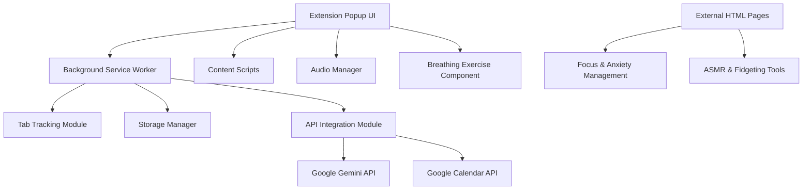

# Design Document

## Overview

The Focus Productivity Extension is a comprehensive Chrome extension built with Manifest V3 that combines productivity monitoring, task management, and wellness features. The extension uses a modular architecture with separate components for tab tracking, UI management, API integrations, and audio management.

## Architecture

### High-Level Architecture



### Core Components

1. **Service Worker (background.js)**: Handles tab tracking, notifications, and persistent state
2. **Popup Interface (popup.html/js/css)**: Main user interface with all features accessible
3. **Content Scripts**: Minimal scripts for tab interaction when needed
4. **External Pages**: Standalone HTML pages for specialized features
5. **Storage Layer**: Chrome storage API for persistence
6. **API Layer**: Handles external API communications

## Components and Interfaces

### 1. Service Worker (background.js)

**Responsibilities:**
- Track active tab changes and time spent
- Manage screen time and focus reminders
- Handle notification display
- Coordinate with popup for state updates

**Key Functions:**
```javascript
// Tab tracking
trackActiveTab(tabId, url)
updateTabTimer(tabId, timeSpent)
checkScreenTimeLimit(tabId)

// Focus management
setInitialFocusTab(tabId, url)
checkFocusDeviation(currentTabId, focusTabId)

// Notifications
showBreakReminder()
showFocusReminder()
```

### 2. Popup Interface

**Structure:**
- Header with extension title and settings
- Screen time monitoring section
- Focus tracking controls
- Task management area (Gemini integration)
- Calendar integration controls
- Wellness tools section (breathing, white noise)
- External page access buttons

**Layout Design:**
```
┌─────────────────────────────────┐
│ Focus Productivity Extension    │
├─────────────────────────────────┤
│ Screen Time: 25 min [Settings]  │
│ Focus Tab: example.com [Reset]  │
├─────────────────────────────────┤
│ Task Breakdown                  │
│ [Input Task] [Get AI Breakdown] │
│ [Task List Display Area]        │
├─────────────────────────────────┤
│ Calendar Reminders              │
│ [Task] [Deadline] [Priority]    │
│ [Create Reminders]              │
├─────────────────────────────────┤
│ Wellness Tools                  │
│ [Breathing Exercise] [🔊 White] │
│ [Focus & Anxiety] [ASMR Tools] │
└─────────────────────────────────┘
```

### 3. Tab Tracking Module

**Data Structure:**
```javascript
{
  tabId: {
    url: string,
    startTime: timestamp,
    totalTime: number,
    isActive: boolean
  }
}
```

**Tracking Logic:**
- Listen to chrome.tabs.onActivated
- Listen to chrome.tabs.onUpdated
- Calculate time differences
- Store in chrome.storage.local
- Trigger notifications based on thresholds

### 4. API Integration Module

**Gemini API Integration:**
```javascript
class GeminiService {
  async breakdownTask(taskName, deadline) {
    // Send request to Gemini API
    // Parse structured response
    // Return actionable steps
  }
}
```

**Calendar API Integration:**
```javascript
class CalendarService {
  async createTaskReminders(task, deadline, priority) {
    // Calculate reminder times based on priority
    // Create multiple calendar events
    // Handle authentication and errors
  }
}
```

### 5. Audio Manager

**White Noise Component:**
```javascript
class AudioManager {
  constructor() {
    this.whiteNoiseAudio = new Audio('sounds/white-noise.mp3')
    this.isPlaying = false
  }
  
  toggleWhiteNoise()
  setVolume(level)
  cleanup()
}
```

### 6. Breathing Exercise Component

**Animation System:**
```javascript
class BreathingExercise {
  constructor(container) {
    this.phases = ['inhale', 'hold', 'exhale', 'hold']
    this.durations = [4000, 1000, 4000, 1000] // milliseconds
    this.currentPhase = 0
  }
  
  startExercise()
  animateCircle()
  updateInstructions()
  stopExercise()
}
```

## Data Models

### Tab Tracking Data
```javascript
{
  currentSession: {
    focusTabId: number,
    focusUrl: string,
    sessionStartTime: timestamp
  },
  tabHistory: {
    [tabId]: {
      url: string,
      totalTime: number,
      lastActiveTime: timestamp,
      breakRemindersShown: number
    }
  },
  settings: {
    screenTimeLimit: number, // minutes
    focusReminderCooldown: number, // minutes
    breakReminderEnabled: boolean,
    focusReminderEnabled: boolean
  }
}
```

### Task Management Data
```javascript
{
  tasks: [
    {
      id: string,
      name: string,
      deadline: timestamp,
      priority: 'high' | 'medium' | 'low',
      breakdown: string[],
      remindersCreated: boolean,
      createdAt: timestamp
    }
  ],
  apiKeys: {
    gemini: string,
    googleCalendar: string
  }
}
```

### Audio Settings Data
```javascript
{
  whiteNoise: {
    enabled: boolean,
    volume: number,
    lastState: boolean
  },
  breathing: {
    customDurations: {
      inhale: number,
      holdIn: number,
      exhale: number,
      holdOut: number
    }
  }
}
```

## Error Handling

### API Error Handling
- **Gemini API Failures**: Show fallback message with manual task breakdown option
- **Calendar API Failures**: Provide manual reminder creation instructions
- **Network Issues**: Cache requests and retry with exponential backoff
- **Authentication Errors**: Clear stored tokens and prompt re-authentication

### Extension Error Handling
- **Storage Quota Exceeded**: Implement data cleanup and user notification
- **Permission Denied**: Guide user through permission granting process
- **Tab Access Errors**: Gracefully handle restricted tabs (chrome://, etc.)

### Audio Error Handling
- **Audio Loading Failures**: Provide silent fallback and user notification
- **Playback Interruption**: Restore state when possible
- **Browser Audio Policy**: Handle autoplay restrictions

## Testing Strategy

### Unit Testing
- **Tab Tracking Logic**: Test time calculations and state management
- **API Integration**: Mock API responses and test error scenarios
- **Audio Management**: Test playback controls and state persistence
- **Breathing Exercise**: Test animation timing and user interactions

### Integration Testing
- **Chrome APIs**: Test with actual Chrome extension APIs
- **External APIs**: Test with real Gemini and Calendar API endpoints
- **Cross-Component Communication**: Test popup-background communication
- **Storage Operations**: Test data persistence and retrieval

### User Acceptance Testing
- **Screen Time Monitoring**: Verify accurate time tracking and notifications
- **Focus Management**: Test focus deviation detection and reminders
- **Task Management**: Test complete workflow from input to calendar creation
- **Wellness Features**: Test breathing exercises and audio functionality
- **External Pages**: Verify proper page loading and functionality

### Performance Testing
- **Memory Usage**: Monitor extension memory footprint
- **CPU Impact**: Test background processing efficiency
- **Storage Usage**: Monitor local storage consumption
- **Battery Impact**: Test on mobile devices if applicable

### Security Testing
- **API Key Storage**: Verify secure storage of sensitive data
- **External Page Security**: Test for XSS vulnerabilities
- **Permission Usage**: Verify minimal permission requirements
- **Data Privacy**: Ensure no sensitive data leakage

## File Structure

```
focus-productivity-extension/
├── manifest.json
├── background.js
├── popup/
│   ├── popup.html
│   ├── popup.js
│   ├── popup.css
│   └── components/
│       ├── breathing-exercise.js
│       ├── task-manager.js
│       └── audio-manager.js
├── content/
│   └── content.js
├── external-pages/
│   ├── focus-anxiety.html
│   ├── focus-anxiety.js
│   ├── focus-anxiety.css
│   ├── asmr-fidget.html
│   ├── asmr-fidget.js
│   └── asmr-fidget.css
├── services/
│   ├── tab-tracker.js
│   ├── gemini-service.js
│   ├── calendar-service.js
│   └── storage-manager.js
├── assets/
│   ├── icons/
│   │   ├── icon16.png
│   │   ├── icon48.png
│   │   └── icon128.png
│   └── sounds/
│       ├── white-noise.mp3
│       └── notification.mp3
└── utils/
    ├── constants.js
    └── helpers.js
```

## Implementation Considerations

### Manifest V3 Specific Requirements
- Use service workers instead of background pages
- Implement proper message passing between components
- Handle dynamic imports for code splitting
- Use chrome.action API for popup management

### Performance Optimizations
- Lazy load external pages and heavy components
- Implement efficient tab tracking with minimal overhead
- Use chrome.storage.local for fast data access
- Optimize audio file sizes and loading

### User Experience Design
- Maintain consistent visual design across all components
- Provide clear feedback for all user actions
- Implement smooth animations and transitions
- Ensure accessibility compliance (WCAG 2.1)

### Privacy and Security
- Store API keys securely using chrome.storage.local
- Implement proper content security policy
- Minimize data collection and storage
- Provide clear privacy information to users