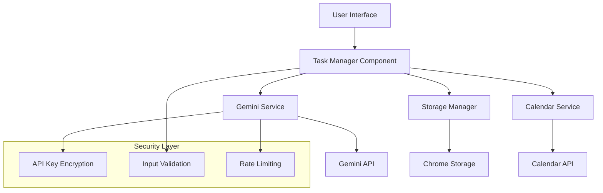
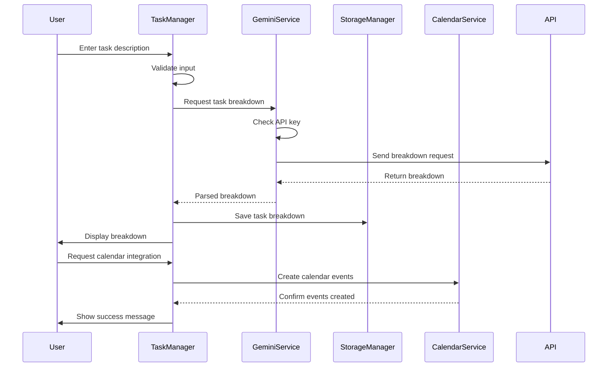

# Task Breakdown Feature Design

## Overview

The Task Breakdown feature is an AI-powered productivity tool that helps users decompose complex tasks into manageable subtasks using Google's Gemini API. The system provides intelligent task analysis, time estimation, priority assignment, and integration with calendar systems for comprehensive task management.

## Architecture

### High-Level Architecture



### Component Interaction Flow



## Components and Interfaces

### 1. TaskManager Component

**Purpose**: Main orchestrator for task breakdown functionality

**Key Methods**:
- `processTask(taskDescription)`: Validates and processes user input
- `displayBreakdown(breakdown)`: Renders task breakdown in UI
- `saveTaskHistory(task)`: Persists task data to storage
- `loadTaskHistory()`: Retrieves historical tasks
- `exportToCalendar(breakdown)`: Integrates with calendar service

**Dependencies**: GeminiService, StorageManager, CalendarService

### 2. GeminiService

**Purpose**: Handles all interactions with Google's Gemini API

**Key Methods**:
- `setApiKey(key)`: Securely stores API key
- `validateApiKey(key)`: Verifies API key validity
- `generateTaskBreakdown(task)`: Requests AI breakdown
- `parseResponse(response)`: Processes API response
- `handleRateLimit()`: Manages API rate limiting

**Configuration**:
```javascript
{
  baseUrl: 'https://generativelanguage.googleapis.com/v1beta/models/gemini-pro:generateContent',
  maxRetries: 3,
  timeout: 10000,
  rateLimitDelay: 1000
}
```

### 3. TaskBreakdownUI Component

**Purpose**: Renders and manages the task breakdown interface

**Key Features**:
- Task input form with validation
- Breakdown display with checkboxes
- Progress tracking
- History navigation
- Settings panel for API key management

### 4. API Key Manager

**Purpose**: Secure management of Gemini API keys

**Security Features**:
- Client-side encryption using Web Crypto API
- Secure storage in Chrome extension storage
- Key validation before storage
- Automatic key rotation support

## Data Models

### Task Model

```javascript
{
  id: string,                    // Unique task identifier
  title: string,                 // Original task description
  description: string,           // Detailed task description
  breakdown: SubTask[],          // Array of subtasks
  status: 'pending' | 'in_progress' | 'completed',
  createdAt: timestamp,
  updatedAt: timestamp,
  estimatedDuration: number,     // Total estimated time in minutes
  actualDuration: number,        // Actual time spent
  priority: 'low' | 'medium' | 'high',
  tags: string[],               // User-defined tags
  calendarIntegrated: boolean   // Whether calendar events were created
}
```

### SubTask Model

```javascript
{
  id: string,                   // Unique subtask identifier
  title: string,                // Subtask description
  description: string,          // Detailed subtask description
  estimatedDuration: number,    // Estimated time in minutes
  actualDuration: number,       // Actual time spent
  priority: 'low' | 'medium' | 'high',
  status: 'pending' | 'in_progress' | 'completed',
  dependencies: string[],       // IDs of prerequisite subtasks
  notes: string,               // User notes
  completedAt: timestamp       // Completion timestamp
}
```

### API Response Model

```javascript
{
  success: boolean,
  data: {
    breakdown: SubTask[],
    summary: string,
    totalEstimatedTime: number,
    recommendedOrder: string[],
    tips: string[]
  },
  error: {
    code: string,
    message: string,
    retryable: boolean
  }
}
```

## Error Handling

### Error Categories

1. **API Errors**
   - Invalid API key
   - Rate limit exceeded
   - Network connectivity issues
   - Service unavailable

2. **Validation Errors**
   - Empty task input
   - Task too long
   - Invalid characters
   - Inappropriate content

3. **Storage Errors**
   - Storage quota exceeded
   - Corruption detection
   - Permission denied

4. **Integration Errors**
   - Calendar API failures
   - Authentication issues
   - Sync conflicts

### Error Recovery Strategies

```javascript
const errorRecoveryStrategies = {
  'API_KEY_INVALID': {
    action: 'prompt_for_new_key',
    message: 'Please enter a valid Gemini API key',
    retryable: false
  },
  'RATE_LIMIT_EXCEEDED': {
    action: 'exponential_backoff',
    message: 'API rate limit exceeded. Retrying...',
    retryable: true,
    delay: 1000
  },
  'NETWORK_ERROR': {
    action: 'offline_mode',
    message: 'Network unavailable. Using cached data.',
    retryable: true
  },
  'STORAGE_FULL': {
    action: 'cleanup_old_tasks',
    message: 'Storage full. Cleaning up old tasks.',
    retryable: true
  }
}
```

## Testing Strategy

### Unit Tests

1. **GeminiService Tests**
   - API key validation
   - Request formatting
   - Response parsing
   - Error handling
   - Rate limiting

2. **TaskManager Tests**
   - Task validation
   - Breakdown processing
   - History management
   - Calendar integration

3. **UI Component Tests**
   - Form validation
   - User interactions
   - State management
   - Accessibility

### Integration Tests

1. **End-to-End Workflow**
   - Complete task breakdown flow
   - Calendar integration
   - Error recovery
   - Offline functionality

2. **API Integration**
   - Real Gemini API calls
   - Rate limiting behavior
   - Error response handling

### Performance Tests

1. **Load Testing**
   - Multiple concurrent requests
   - Large task descriptions
   - History with many tasks

2. **Memory Usage**
   - Task history storage
   - Component lifecycle
   - Memory leak detection

## Security Considerations

### API Key Security

1. **Encryption**: API keys encrypted using Web Crypto API before storage
2. **Obfuscation**: Keys never logged or exposed in plain text
3. **Validation**: Keys validated before use to prevent injection
4. **Rotation**: Support for key rotation and updates

### Data Privacy

1. **Local Storage**: All task data stored locally in Chrome storage
2. **No Tracking**: No user data sent to external services except Gemini API
3. **Secure Transmission**: All API calls use HTTPS
4. **Data Minimization**: Only necessary data sent to API

### Input Sanitization

1. **XSS Prevention**: All user input sanitized before display
2. **Content Filtering**: Inappropriate content detection and filtering
3. **Length Limits**: Input length restrictions to prevent abuse
4. **Character Validation**: Only allowed characters accepted

## Performance Optimization

### Caching Strategy

1. **Response Caching**: Cache API responses for similar tasks
2. **Offline Support**: Store recent breakdowns for offline access
3. **Lazy Loading**: Load task history on demand
4. **Debouncing**: Debounce user input to reduce API calls

### Resource Management

1. **Memory Management**: Efficient cleanup of unused components
2. **Request Batching**: Batch multiple requests when possible
3. **Connection Pooling**: Reuse HTTP connections
4. **Compression**: Compress stored data to save space

## Accessibility Features

### Keyboard Navigation

1. **Tab Order**: Logical tab order through all interactive elements
2. **Keyboard Shortcuts**: Common shortcuts for frequent actions
3. **Focus Management**: Clear focus indicators and management

### Screen Reader Support

1. **ARIA Labels**: Comprehensive ARIA labeling
2. **Live Regions**: Dynamic content updates announced
3. **Semantic HTML**: Proper HTML structure and semantics

### Visual Accessibility

1. **High Contrast**: Support for high contrast mode
2. **Font Scaling**: Respect user font size preferences
3. **Color Independence**: Information not conveyed by color alone

## Deployment Considerations

### Chrome Extension Manifest

```json
{
  "permissions": [
    "storage",
    "activeTab"
  ],
  "host_permissions": [
    "https://generativelanguage.googleapis.com/*"
  ],
  "content_security_policy": {
    "extension_pages": "script-src 'self'; object-src 'self'"
  }
}
```

### Environment Configuration

1. **Development**: Local testing with mock API responses
2. **Staging**: Integration testing with real API
3. **Production**: Full functionality with error monitoring

### Monitoring and Analytics

1. **Error Tracking**: Log errors for debugging (privacy-safe)
2. **Usage Metrics**: Track feature usage patterns
3. **Performance Monitoring**: Monitor API response times
4. **User Feedback**: Collect user feedback for improvements